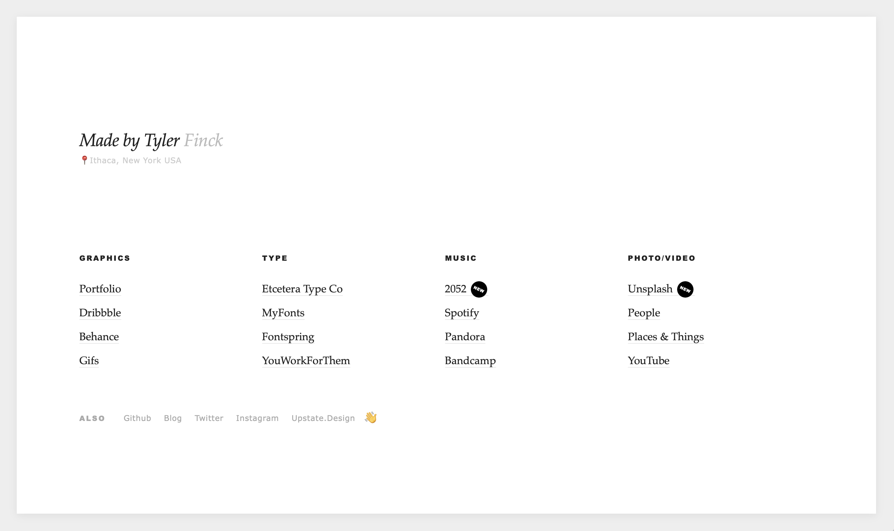

# pageoflinks
 One page of links.

I created this breath of fresh air since my online connections are sprawling (for better or for worse). It is no nonsense – zero webfonts, no graphics other than a few emojis, even the CSS is just over 100 lines – for the sake of speed and functionality. The goal: this page was built to take people somewhere else. This readme is a larger file size than both the html + css combined.

You can view it live at: [madebytyler.com](https://www.madebytyler.com)

